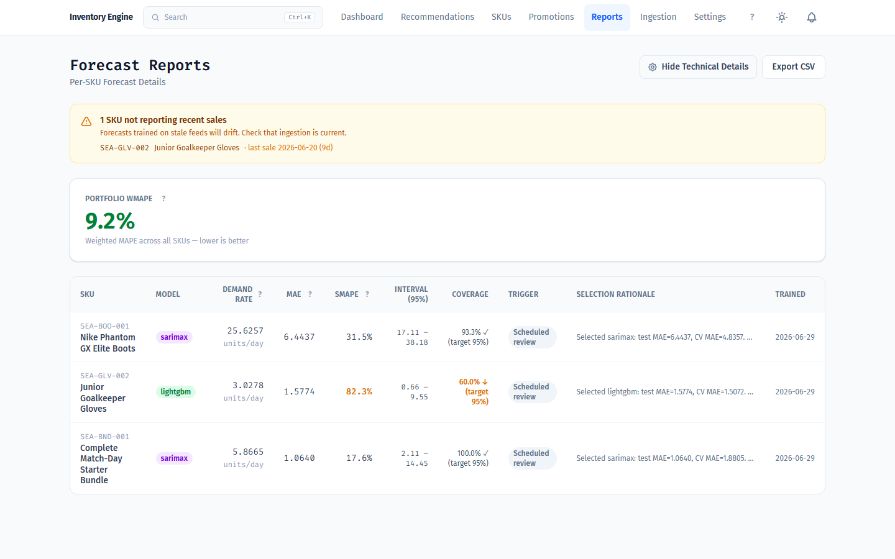

# Inventory Decision Engine

A hybrid **demand‑forecasting + inventory‑decision** system for e‑commerce
retailers: a Python forecasting microservice that selects the best model per
SKU and quantifies its own uncertainty, wired into a Laravel/Vue/MySQL
application that turns those forecasts into auditable `ORDER NOW` / `WATCH` /
`HOLD` recommendations and learns from whether they were acted on.

> **Portfolio / open‑source note.** This is a polished, self‑contained build
> published as a portfolio piece. **All data is synthetic** — there is no real
> customer data anywhere in the repo. The demo dataset models a fictional
> South‑East‑Asian e‑commerce store selling **football (soccer) gear**
> (boots, grip socks, goalkeeper gloves, shin guards, team socks, ball pumps,
> and bundles).

---

## Screenshots

**Forecast Reports** — multi-criteria model selection per SKU (SARIMAX, LightGBM, Holt-Winters, …), each with 95% prediction intervals, empirical coverage vs. target, and the full selection rationale.



**Dashboard** — `ORDER NOW` / `WATCH` / `HOLD` recommendations with urgency, days of cover, lead time, and dead-stock alerts.


**SKU detail** — the full reorder calculation for one SKU: effective position, lead time, buffer, safety stock, reorder point, and recommended quantity.


**Forecast settings** — every threshold is configurable per category (Equipment / Accessories / Bundles), plus the feedback-loop and decision-calibration levers.


---

## What it does

Most small/mid e‑commerce operators replenish stock from gut feel and a
spreadsheet, which produces the two classic failure modes at once: stockouts on
fast movers and dead capital tied up in overstock. This system replaces the
guesswork with a data‑driven pipeline:

1. **Ingest** sales history, stock positions, and supplier lead times (CSV
   upload or a Shopify connector).
2. **Forecast** demand per SKU with a model chosen specifically for that SKU's
   demand shape, complete with prediction intervals.
3. **Decide** what to do about each SKU — combining the forecast with inventory
   position, lead‑time uncertainty, MOQ/budget constraints, and an ABC/XYZ
   classification — and emit a recommendation with a quantity.
4. **Track & learn** — each recommendation moves through a status lifecycle
   (`PENDING → ACKNOWLEDGED → ORDERED → RECEIVED`, or `IGNORED` / `SUPERSEDED`),
   and the realized outcomes feed back into the forecasting tier.

It is deliberately a **recommendation and tracking engine, not a procurement
platform** — it does not raise POs, message suppliers, or handle invoicing. The
operator keeps ordering through their existing channels and records the outcome,
which is what makes the feedback loop possible.

---

## Modeling decisions worth highlighting

These are the parts that make this more than a CRUD app, and the parts most
relevant to a data‑science / analytics‑engineering review.

### 1. Multi‑criteria model selection (per SKU)

Each SKU runs through a 15‑stage pipeline that fits a panel of candidate models
— **Holt‑Winters, SARIMAX (with auto‑ARIMA order search), Prophet, LightGBM,
Croston (for intermittent demand), and an ETS fallback** — and then picks a
winner using a **lexicographic, multi‑criteria rule**, not a single error
metric:

1. **Must beat the best naive/seasonal baseline** on walk‑forward CV MAE
   (within a tolerance band) — if nothing beats a baseline, the system *uses the
   baseline*. ML is not applied where it doesn't earn its keep.
2. Lowest **held‑out test MAE** among the survivors.
3. Lower **bias magnitude** when MAE is statistically tied.
4. **Diagnostic fitness** — penalize residual autocorrelation (Ljung‑Box) and
   poor promotion‑period accuracy.
5. **Simplicity preference** on ties: `ETS > Croston > Holt‑Winters > SARIMAX >
   Prophet > LightGBM`. Prefer the model you can explain.

Every selection writes a human‑readable **rationale** plus the full candidate
comparison table to `python/forecasting/reports/`, so any decision is auditable
after the fact.

### 2. Prediction intervals (not just point forecasts)

Every forecast ships with an interval, generated by the method appropriate to
the winning model: native statsmodels intervals for Holt‑Winters/SARIMAX,
**residual bootstrap** for LightGBM, and a residual‑std proxy for ETS/Croston.
A point forecast with no uncertainty is close to useless for a safety‑stock
decision; the decision tier consumes the interval width directly.

### 3. Coverage correction

Nominal intervals routinely lie — a "90%" interval that only contains 70% of
held‑out actuals will quietly cause stockouts. The pipeline therefore
**measures empirical coverage on the held‑out set** and, when coverage falls
below an acceptable floor, **widens the interval by a calibrated correction
factor** and re‑validates. Intervals are honest about how wrong they've been.

### 4. The feedback loop

Recommendations are not fire‑and‑forget. Action‑tracking data (was the
recommendation ordered? ignored? did a stockout follow a `HOLD`?) is analyzed on
a weekly job. When realized demand drifts from forecast beyond a bias threshold,
a `ForecastDriftDetected` event re‑triggers forecasting for the affected SKUs
with a `bias_drift` reason. New SKUs and a monthly sweep trigger re‑evaluation
too. The model that wins today is not assumed to win forever.

### Supporting design choices

- **Forecasting is one signal, not the whole engine.** A pure forecast‑first
  approach was rejected (unacceptable error on sparse/promo‑driven SKUs). The
  `DecisionScorer` combines `demand_rate` with inventory position, lead‑time
  uncertainty, and constraints. The PHP side never needs to know whether ARIMA
  or LightGBM produced the number.
- **SKU demand‑shape classification** (clean / intermittent / promo‑spiky /
  stopped‑selling) routes each SKU to appropriate models and per‑category
  forecasting thresholds.
- **Backtesting is the walk‑forward CV itself** — fold‑level metrics are stored,
  not surfaced as a what‑if dashboard.
- **Every numerical lever is configuration**, not a magic number — thresholds,
  weights, and multipliers live in `python/forecasting/config/forecasting_config.yaml`
  and the `system_settings` table.

---

## Architecture

```
                    ┌─────────────────────────────────────────────┐
                    │            Browser (Vue 3 SPA)              │
                    │   Dashboard · SKUs · Reports · Promotions   │
                    └───────────────────────┬─────────────────────┘
                                            │  Inertia.js (no separate API layer)
                    ┌───────────────────────▼─────────────────────┐
                    │            Laravel 12 application            │
                    │                                             │
                    │  Services/InventoryEngine/                  │
                    │    DemandForecaster ─ reads forecast registry│
                    │    InventoryPositionTracker · LeadTimeHandler│
                    │    ConstraintEngine · AbcXyzClassifier       │
                    │    DecisionScorer ─► ORDER NOW / WATCH / HOLD│
                    │    DecisionStatusService (audit lifecycle)   │
                    │                                             │
                    │  Jobs (Horizon queues)                      │
                    │    RunForecastJob ──────────┐                │
                    │    RunInventoryEngineJob     │                │
                    │    AnalyzeRecommendationFeedbackJob          │
                    │  Services/Ingestion/ (CSV + Shopify adapter) │
                    └──────────┬──────────────────┼────────────────┘
                               │                  │ Process::run(python … --input <json>)
              MySQL / Redis ◄──┘                  ▼
              (data, queues,            ┌──────────────────────────────┐
               broadcasting)            │   Python forecasting service  │
                                        │   python/forecasting/main.py  │
                                        │   15‑stage pipeline:          │
                                        │   audit → preprocess → EDA →  │
                                        │   features → CV/validation →  │
                                        │   model fits → diagnostics →  │
                                        │   intervals (+coverage corr.) │
                                        │   → multi‑criteria selection  │
                                        │   → registry JSON to stdout   │
                                        └──────────────────────────────┘
```

- The Laravel app dispatches `RunForecastJob`, which calls the Python service as
  a **subprocess** (`python main.py --input <path>`) and reads back a JSON result
  (winning model, `demand_rate`, intervals, hyperparameters, selection rationale,
  diagnostics, warnings). The result is written to the `forecast_model_registry`
  table; the engine consumes `demand_rate` from there.
- **Real‑time stock alerts** are broadcast over Laravel Reverb (WebSockets) to
  the Vue frontend.
- **Multi‑tenant by construction** — all core tables carry `tenant_id` with a
  global Eloquent scope; the demo runs as `tenant_id = 1`.
- **Role‑based access** (owner / warehouse / viewer) via Spatie Permissions.

---

## Tech stack

| Layer | Stack |
|---|---|
| Backend | PHP 8.3, Laravel 12, Sanctum, Horizon, Reverb, Fortify, Spatie Permissions |
| Forecasting | Python 3.11+, statsmodels, pmdarima, Prophet*, LightGBM*, pandas/numpy/scipy/scikit‑learn (*optional, auto‑activated when installed) |
| Frontend | Vue 3 (`<script setup lang="ts">`), Inertia.js v2, TypeScript, Tailwind CSS v4, Vite |
| Data | MySQL 8+ (or SQLite for quick local runs), Redis 7+ |
| Testing | Pest 4 |
| Deploy | Dockerfile + Fly.io config included |

---

## Repository layout

```
app/
  Services/InventoryEngine/    decision engine (scorer, classifier, trackers, lifecycle)
  Services/Ingestion/          adapter-pattern importers (CSV, Shopify)
  Services/Synthetic/          synthetic SEA dataset generators
  Jobs/                        RunForecastJob, RunInventoryEngineJob, feedback job
python/forecasting/
  main.py                      pipeline entry point (--input <json>)
  pipeline/                    audit, preprocessing, eda, features, validation,
                               diagnostics, intervals, monitoring
  models/                      holt_winters, sarimax, prophet, lightgbm, croston,
                               ets_fallback, selection
  config/forecasting_config.yaml   every pipeline parameter
resources/js/                  Vue 3 + Inertia pages and components
database/
  migrations/                  schema
  seeders/                     SyntheticDataSeeder + SEA football dataset
  seeders/data/sea_sku_catalog.php   the 30-SKU demo catalog
Synthetic dataset/             standalone CSV sample dataset (football gear)
docs/                          architecture, engine, forecasting, ingestion docs
```

---

## Running it locally

### Prerequisites
- PHP 8.3 + Composer
- Node 18+ and npm
- Python 3.11+
- (Optional) MySQL 8+ and Redis 7+ — the quick path below uses SQLite and
  synchronous queues so you can run with no external services.

### Setup

```bash
# 1. PHP dependencies
composer install

# 2. JS dependencies
npm install

# 3. Environment
cp .env.example .env
php artisan key:generate

# 4. Python forecasting service
python -m venv .venv && source .venv/bin/activate   # Windows: .venv\Scripts\activate
pip install -r python/forecasting/requirements.txt
#   Prophet and LightGBM are optional — the pipeline runs without them and
#   simply skips those candidate models.

# 5. Database + synthetic football dataset
#   .env.example defaults to SQLite, so no DB server is needed.
php artisan migrate --seed
```

`migrate --seed` creates the demo tenant, roles, two demo users, and the 30‑SKU
football dataset with ~30 months of synthetic sales.

**Demo logins** (password is `password` for both):
- `owner@demo.test` — full access, including the threshold Settings editor
- `warehouse@demo.test` — warehouse role

### Run

```bash
# Terminal 1 — Vite dev server (required, or the page is blank)
npm run dev

# Terminal 2 — the app
php artisan serve
# → http://localhost:8000
```

The default `.env` uses `QUEUE_CONNECTION=sync`, so forecasting and engine jobs
run inline — no queue worker needed for a local demo. To exercise the async path
(Horizon, Reverb), point `.env` at MySQL + Redis and run
`php artisan horizon` and `php artisan reverb:start`.

### Forecasting service on its own

```bash
python python/forecasting/main.py --input path/to/input.json
```

The input/output JSON schema is documented in `docs/FORECASTING_ENGINE.md`.

### Tests

```bash
php artisan test            # or: ./vendor/bin/pest
```

---

## The synthetic dataset

Two independent synthetic datasets ship with the repo, both football gear, both
fully generated (no real data):

- **DB seeder dataset** (`database/seeders/data/sea_sku_catalog.php`) — 30 SKUs
  across `equipment` / `accessory` / `bundle`, five suppliers spanning 5‑to‑28‑day
  lead times, with per‑SKU demand "pathologies" (clean, sparse/intermittent,
  promo‑spiky, stopped‑selling) so the model‑selection logic has something
  interesting to chew on. Sales are shaped by a South‑East‑Asian e‑commerce
  seasonal calendar (9.9/10.10/11.11/12.12 mega‑sales, CNY, Hari Raya, Songkran,
  BFCM, monsoon dampening) plus a promotion‑campaign generator.
- **Standalone CSV dataset** (`Synthetic dataset/*.csv`) — a smaller 11‑SKU
  catalog with daily sales and current‑stock files, handy for trying the CSV
  importer.

---

## License

Released under the MIT License — see [LICENSE](LICENSE).

---

## Disclaimer

This is an independent portfolio project built on **entirely synthetic data**.
Product names and brands used in the sample data are for illustration only and
imply no affiliation or endorsement.
