# Screenshots

A walkthrough of the Inventory Decision Engine, grouped by the workflow it supports.

All data shown is **synthetic** — a fictional South-East-Asian store selling football
(soccer) gear, with 30 SKUs, ~30 months of sales history, and 62 promotional
campaigns. No real customer data appears anywhere in this repo.

Terms used in these screens (ABC/XYZ, days of cover, buffer, WMAPE) are defined in
[`GLOSSARY.md`](GLOSSARY.md).

---

## Walkthrough

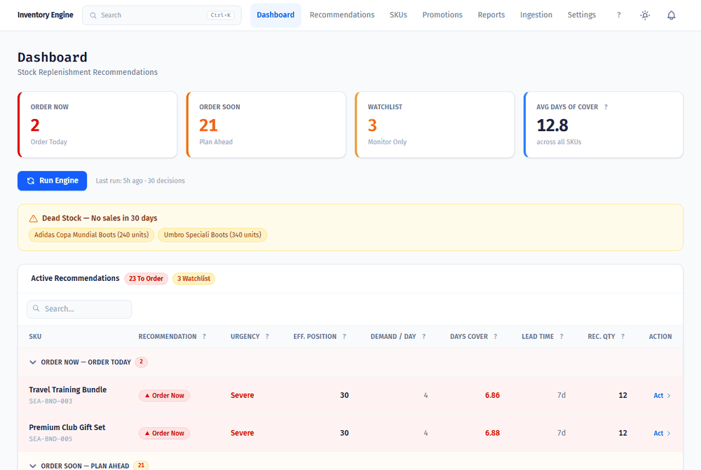

Dashboard → per-SKU forecast model → promotions → settings → dark mode.

---

## Daily operation

### Dashboard

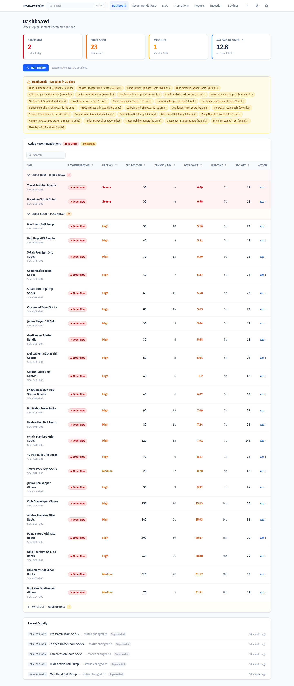

The morning view. Four KPI cards summarise the fleet: how many SKUs to order today,
how many to plan for this week, how many to watch, and the average days of cover
across the catalogue. Below, every flagged SKU is grouped into exclusive tiers —
Order Now (cover has fallen below supplier lead time), Order Soon (cover still above
lead time, so there is runway), and Watchlist (monitor only). Each row carries the
signals behind the call: effective position, demand per day, days of cover, lead
time, and the recommended quantity. A dead-stock panel lists SKUs with no sales in
30 days, and a recent-activity feed tracks status changes.

### Recommendation queue

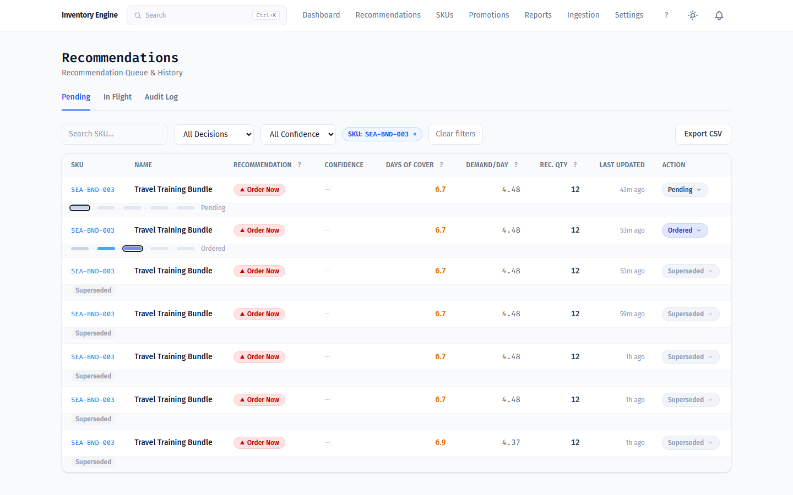

Every recommendation the engine has produced, filterable by decision type,
confidence, and SKU, with Pending / In Flight / Audit Log tabs and CSV export. The
inline progress bar under each row shows where that recommendation sits in its
lifecycle. Superseded rows are retained rather than deleted — when the engine
re-runs and issues a fresh recommendation for a SKU, the previous one is marked
`SUPERSEDED` and back-linked, so the full decision history stays auditable.

### Acting on a recommendation

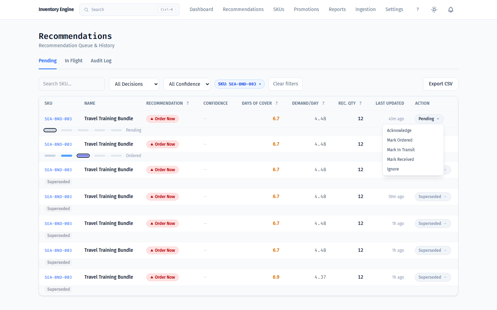

The operator records what they actually did. Transitions run through
`DecisionStatusService`, which validates the move, stamps audit columns, and appends
to a `status_history` JSON trail — `inventory_decisions.status` is deliberately not
mass-assignable. This is the input side of the feedback loop: because the system
knows which recommendations were acted on, ignored, or superseded, it can measure
its own hit rate and trigger forecast re-evaluation when the numbers drift.

---

## Per-SKU depth

### SKU catalogue

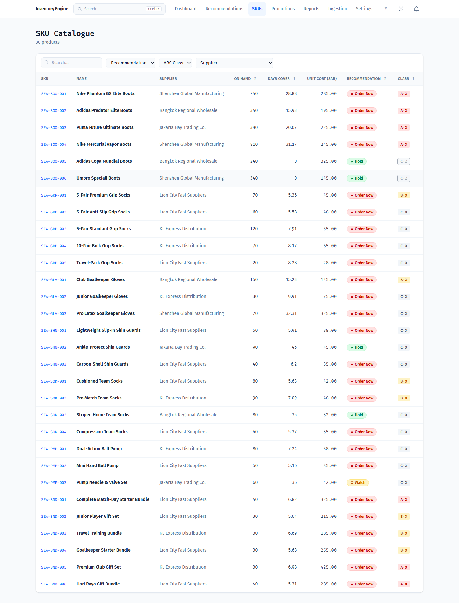

All 30 SKUs with supplier, on-hand stock, days of cover, unit cost, current
recommendation, and ABC·XYZ class. Filterable by recommendation, ABC class, and
supplier.

### SKU detail

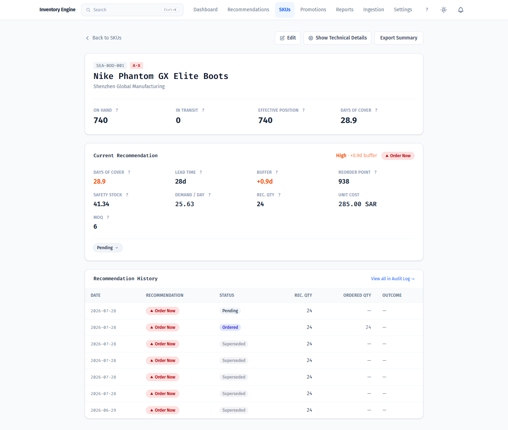

The full inventory position for one SKU, and the arithmetic behind its
recommendation: days of cover against supplier lead time, the resulting buffer,
reorder point, safety stock, demand per day, MOQ, and the constrained order
quantity. Recommendation history for the SKU sits underneath.

### Forecast model detail

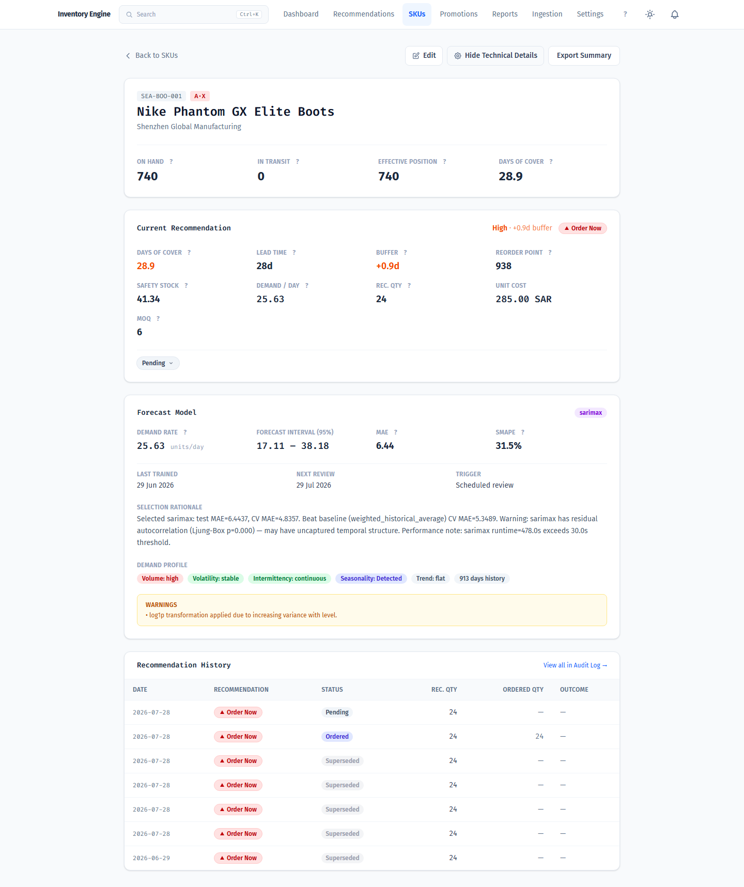

The same page with technical details expanded. This is the forecasting tier made
legible: which model won for this SKU, its demand rate and 95% prediction interval,
held-out MAE and sMAPE, when it was trained, when it is next due for review, and
what triggered the last run. The selection rationale is written in prose — including
the warnings, such as residual autocorrelation flagged by Ljung-Box, or a runtime
that exceeded its threshold. The demand profile chips (volume, volatility,
intermittency, seasonality, trend, history length) show the classification that
determined which models were even eligible to compete.

---

## Forecasting

### Forecast reports

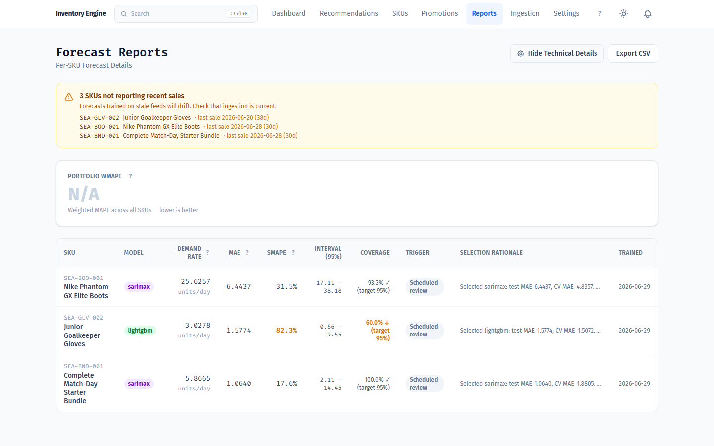

Per-SKU model outcomes across the catalogue: the winning model, demand rate, MAE,
sMAPE, the 95% interval, measured interval coverage against target, what triggered
the run, and the selection rationale. Coverage is checked against held-out data
rather than assumed — a model whose intervals do not hold up is flagged, and the
intervals are widened to compensate. The stale-feed banner is a deliberate honesty
check: it warns when a SKU's sales feed has gone quiet, because a forecast trained
on a stale feed will drift.

Note that backtesting is intentionally **not** surfaced here. Walk-forward
cross-validation and held-out test evaluation happen inside the Python pipeline and
are stored for engineer inspection; this page reports model outcomes, not historical
what-if comparisons.

---

## Planning around promotions

### Promotional calendar

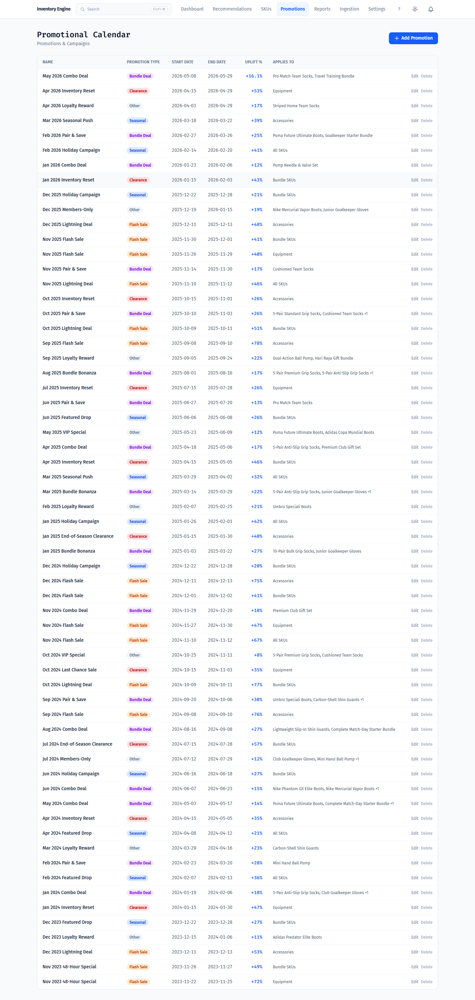

The campaign history the uplift model learns from — 62 campaigns across flash sales,
bundle deals, seasonal pushes, clearances, and loyalty rewards, each with its
realised uplift and its targeting (all SKUs, a category, or named SKUs). Promotions
entered here take precedence over the fallback regional holiday calendar, and both
feed the forecasting tier as exogenous variables.

### Predicted uplift for a planned campaign

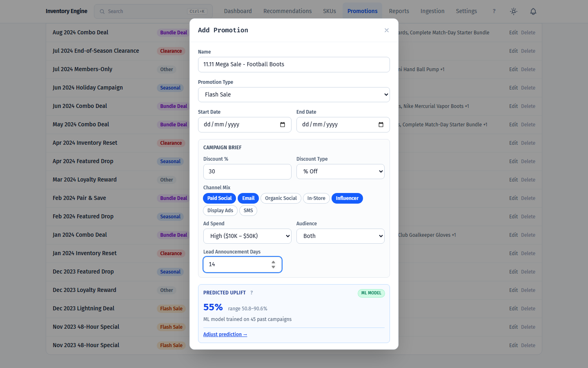

Describe a campaign you are considering — discount, channel mix, ad spend, audience,
how far ahead it is announced — and the system predicts the sales uplift with a
range, before you commit to it. The badge states the basis for the prediction: it
encodes the campaign into a feature vector and matches against similar past
campaigns, then graduates to a trained model once enough history exists. Here it
reports an ML model trained on 45 past campaigns.

---

## Configuration and data

### Forecast settings

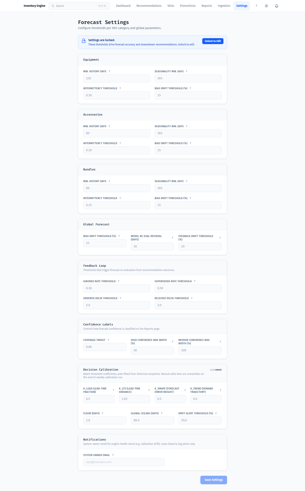

Every numerical lever in the engine is configurable rather than hardcoded:
per-category classification thresholds (equipment, accessories, bundles), global
forecast parameters, the feedback-loop thresholds that decide when recommendation
outcomes should trigger a re-forecast, confidence-label boundaries, and the
decision-scoring coefficients. Settings are locked by default and owner-gated;
the calibration coefficients are auto-fitted from historical snapshots, so manual
edits there are overwritten by the next calibration run.

### Data ingestion

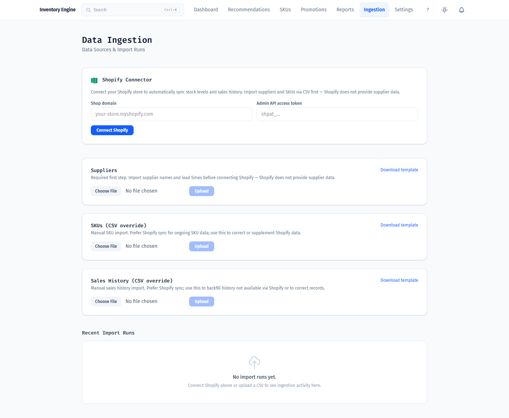

Ingestion is an adapter-pattern plug-in system — every source implements the same
`IngestionSource` interface and the orchestrator is source-agnostic. Shopify is the
primary connector (stock levels and order history, with cursor-based incremental
sync); CSV upload covers what Shopify cannot provide, notably supplier records and
lead times, and serves as the universal fallback. Imports are row-validated with
per-row error reporting and tracked as ingestion runs.

---

## Reference

### Glossary

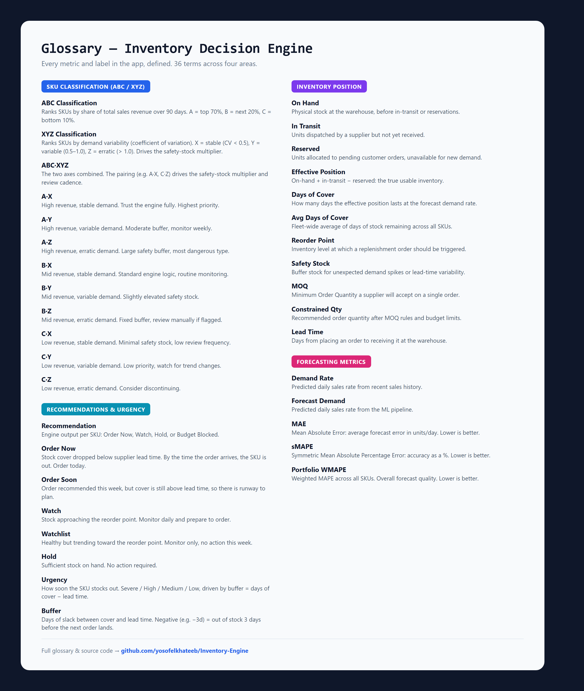

Every user-facing metric and label in the app, defined in one place — 36 terms
across SKU classification, recommendations and urgency, inventory position, and
forecasting metrics. The same definitions drive the in-app glossary panel and the
`?` tooltips next to each metric, from a single source in
`resources/js/composables/useGlossary.ts`.

---

## Dark mode

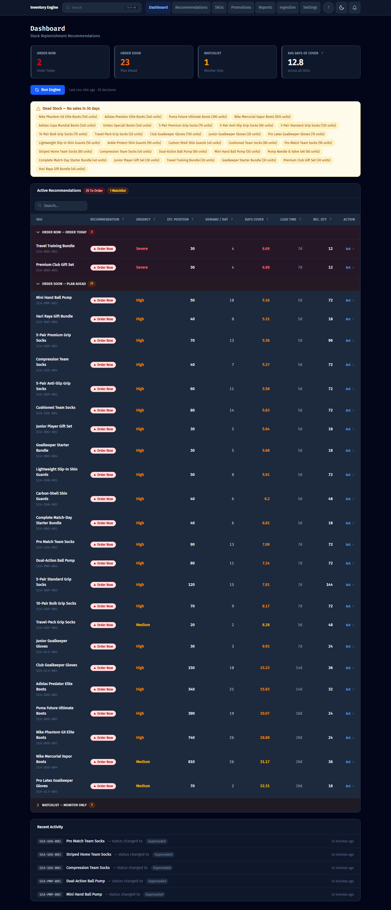

The full interface supports light and dark themes.
